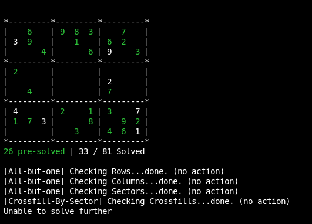

# Readme

I know there are algorithms to solve these puzzles (likely in a better way), but I went at this without researching any
of them to test my own capabilities to take a reasonably complex logical problem into some algorithms.

# Preview

Current used Solutions take it this far

# Cells

The board is broken out into 81 Cell objects. Each Cell has an X and Y value

X increases from left to right, and y increases from top to bottom

Example: Here is a table with the values for the first 2 rows

| y | x | val |
|---|---|---|
| 1 | 1 |  |
| 1 | 2 | 6 |
| 1 | 3 |  |
| 1 | 4 | 9 |
| 1 | 5 | 8 |
| 1 | 6 | 3 |
| 1 | 7 |  |
| 1 | 8 | 7 |
| 1 | 9 |  |
| 2 | 1 | 3 |
| 2 | 2 | 9  |
| 2 | 3 |  |
| 2 | 4 |  |
| 2 | 5 | 1 |
| 2 | 6 |  |
| 2 | 7 | 6 |
| 2 | 8 | 2 |
| 2 | 9 |  |

# Sectors

I also have defined sectors, groups of 9 cells in a square, so sector 1,1 refers to the top left square

# Workflow

The system starts by creating a blank board, which means 81 cells are generated with no value

right now, we also run a secondary process which fills the board with some default data (pictured)

Then we run `Solve()` 81 times - because you shouldn't need more than 81 moves to finish a sudoku board.

the `Solve()` function should do 1 manipulation per run and display an output of what it does, basically it tries to run
each type of solution once, and if it's successful, it will return a string with the description of the solution

# TODO

* Board Org
    * ~~Create Board Object~~
    * ~~Create Cell Object~~
    * ~~Create Column Getter~~
    * ~~Create Row Getter~~
    * ~~Create Sector Getter~~
    * Create Segment Getter
        * Parameters (SectorX, SectorY, direction (Y or X), number int (1-3))
        * Will retrieve a segment of 3 cells within a sector
* Solutions
    * ~~All-But-One Filler~~
        * ~~if you have a row, column, or sector with 8/9 values, you can be certain that the remaining cell must be the
          remaining value~~
    * ~~Cross Fill on 2 sectors with value~~
        * ~~If you have 2 segments with a value, and there is only 1 possible cell in the 3 related segment~~
        * ~~eg: the 3 in [3,8] is horizontally cross filled because of the 3s in [5,9] and [7,7] leaving only that
          cell~~
    * Cross Fill on 1 sector with value, 1 sector with blocked segment
        * Example: (in current state)
            * The 2 in [8,2] blocks cells [4,2], [6,2], and [3,2] from being 2
            * This means that the top middle sector must have a 2 in either [4,3] or [5,3] - which are both in row 3
            * The 2 in [1,4] blocks cells [1,3] and [1,1] from being 2
            * This leaves [2,3] and [3,1] as possible 2's in the top left sector
            * because the top middle sector's 2 is definitely going to be in row 3, we can further eliminate [2,3] from
              possible 2s, leaving only [3,1]
          